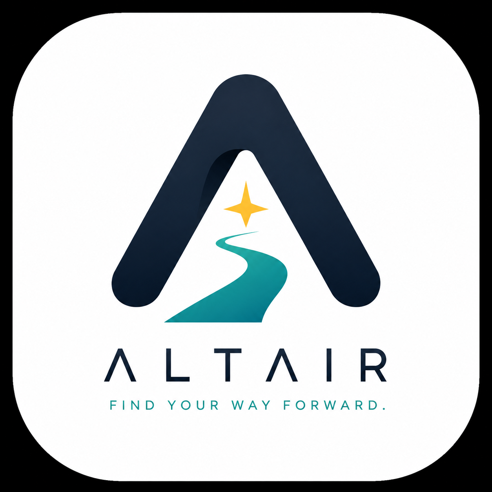
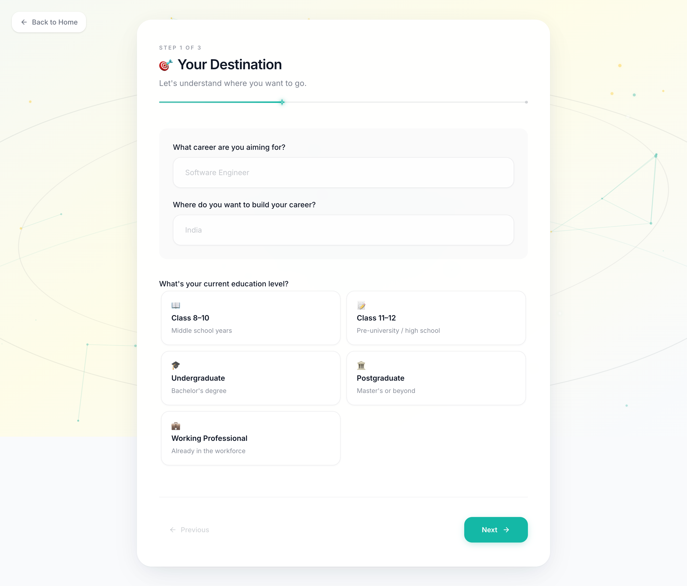

<div align="center">



# ALTAIR

### *Find your way forward.*

**An AI-powered product that turns learner context into structured, personalised education and career roadmaps.**

<br/>

<a href="https://altair-guide.vercel.app/"></a>

<br/><br/>


<br/>

`Google Gemini` · `Structured Output` · `JSON Schema Validation` · `Responsible AI`

</div>

---

## Product Experience

ALTAIR is designed as a guided product rather than a chat interface. The experience begins with a focused questionnaire that captures the learner's direction and context, then turns the generated structure into a roadmap that can be explored section by section.

> **Product screenshots are being prepared for the public showcase.**
>
> Add the final files as `assets/questionnaire-showcase.png` and `assets/roadmap-showcase.png`; the README will display them automatically.

<table>
<tr>
<td width="50%" align="center" valign="top">

### 01 · Understand the learner



<sub>Career direction · education context · current knowledge · learning preferences · available time</sub>

</td>
<td width="50%" align="center" valign="top">

### 02 · Build the roadmap


<sub>Learning phases · skills · projects · resources · certifications · milestones</sub>

</td>
</tr>
</table>

<div align="center">

**Context in → structured guidance out.**

</div>

---

## The Problem

Choosing a career direction is only the beginning. Learners still have to work out **what to learn, in what order, how deeply, through which projects, and within the time they actually have available**.

Generic roadmaps rarely account for where someone is starting from. ALTAIR was built around a different idea: collect meaningful learner context first, then use AI to generate a roadmap that is structured enough to become a usable product experience rather than a block of generated text.

## What ALTAIR Does

ALTAIR guides a learner through a multi-step questionnaire covering their career goal, current knowledge, education context, learning preferences and available time. That context is processed by a Node.js/Express backend and sent to Google Gemini with explicit output requirements.

The generated response is normalised and validated against a roadmap schema before the frontend renders it as a personalised experience containing learning phases, skills, projects, resources, certifications and milestones.

## Product Flow

```text
Learner Context
      ↓
React + TypeScript Questionnaire
      ↓
Node.js + Express API
      ↓
Context & Prompt Construction
      ↓
Google Gemini
      ↓
Structured JSON Output
      ↓
Normalisation + Schema Validation
      ↓
Personalised Roadmap UI
```

## Engineering Highlights

- **Structured AI generation** — Gemini is asked for structured JSON rather than uncontrolled prose.
- **Schema validation** — generated roadmap data is validated before being trusted by the UI.
- **Separation of concerns** — questionnaire UI, domain knowledge, prompt construction, AI provider logic, response parsing and validation live in distinct layers.
- **Domain-aware context** — career domains, pathways, education stages, country rules and journey mappings enrich the request before generation.
- **Responsible AI** — ALTAIR is designed to support learner decision-making rather than present generated guidance as guaranteed or authoritative.
- **Product-focused output** — AI output is transformed into sections users can navigate, refine and export rather than displayed as a raw chat response.

## Core Features

| Personalisation | Roadmap Experience | AI Engineering |
| --- | --- | --- |
| Career goals & context | Learning phases | Gemini integration |
| Current knowledge | Skills & milestones | Structured outputs |
| Study availability | Project recommendations | JSON schema validation |
| Learning preferences | Resources & certifications | Response normalisation |
| Education context | Refine & export flow | Responsible prompting |

## Tech Stack

**Frontend:** React 19, TypeScript, Vite, Tailwind CSS, React Router, Framer Motion  
**Backend:** Node.js, Express, TypeScript  
**AI:** Google Gemini via `@google/genai`  
**Validation:** AJV + JSON Schema  
**Deployment:** Vercel (frontend) + Render (backend)

## Repository Structure

```text
altair/
├── client/
│   └── src/
│       ├── components/
│       │   ├── questionnaire/
│       │   ├── loading/
│       │   └── roadmap/
│       ├── pages/
│       ├── services/
│       └── types/
├── backend/
│   └── src/
│       ├── domain/
│       ├── prompts/
│       ├── providers/
│       ├── schemas/
│       ├── services/
│       └── utils/
├── docs/
└── README.md
```

## Responsible AI

ALTAIR treats generated roadmaps as **guidance, not guarantees**. Learners remain responsible for deciding what goals to pursue, which resources to use and how to adapt their roadmap. The project also documents limitations such as outdated resources, incomplete learning sequences and potential geographic, language, industry or educational bias.

See [Responsible AI](docs/RESPONSIBLE_AI.md) for the project's principles and limitations.

## Running Locally

### Frontend

```bash
cd client
npm install
npm run dev
```

### Backend

```bash
cd backend
npm install
cp .env.example .env
# Add your GEMINI_API_KEY to .env
npm run dev
```

The frontend expects `VITE_API_BASE_URL`. The backend expects `GEMINI_API_KEY`.

## Project Status

ALTAIR is a working MVP deployed on Vercel and Render. The current focus is improving reliability, testing, product polish and documentation while continuing to strengthen the roadmap-generation pipeline.

## Documentation

The `docs/` directory contains the product and engineering thinking behind ALTAIR, including product requirements, personas, user journey, information architecture, design decisions, prompt engineering, API design and Responsible AI documentation.

---

<div align="center">

**Built as a practical exploration of Software Engineering × Artificial Intelligence.**

*ALTAIR — Find your way forward.*

</div>
